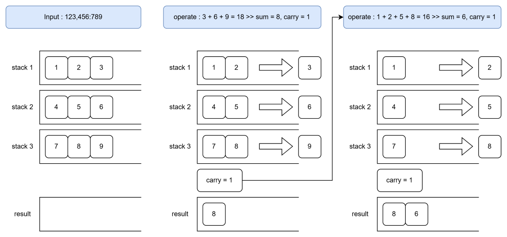

# C : 문자열 덧셈 계산기

C언어를 이용하여 구현한 문자열 덧셈 계산기입니다. 

입력받은 문자열로부터 숫자만 추출하여 덧셈한 뒤 출력하는 간단한 프로그램입니다.

---

## 📌 개요
- 프로그램 기능 : 문자열과 섞인 상태로 입력되는 숫자들의 연산
- 설계 방식 : 세로로 덧셈할 때 각 자리수끼리 더한 후 1의 자리만 남기고 
나머지 숫자는 carry로서 다음 자리수의 연산에 넘긴다.
이를 이용하여 각 자리수의 연산 및 carry 적용을 이용해 여러 수의 연산을
한꺼번에 해결한다.
- 필요한 기능 : 
  1. 문자열 분리기 : 숫자는 남겨두고, 그 외의 모든 문자는 처리한다.
  2. 세로 덧셈 : 큰 숫자를 마지막에 이용하고 작은 숫자를 먼저 처리하기 위해 스택 구조를 이용한다.
  숫자를 분리한 뒤 큰 수 먼저 스택에 입력하면 사용할 때에는 작은 수부터 연산할 수 있다.
  3. 연산 결과 저장 : 반대로 연산 결과는 작은 수부터 스택에 채운다.
  결과 출력 시에는 큰 수부터 출력되도록 설계할 수 있다.
  4. Stack 구조 : Character 타입 배열과 구조체를 이용해 스택 구조를 구현한다.

---

## 📌 프로그램 구조

### 1. char_stack.h
- Character 타입 스택 구조를 메인 함수에 적용하기 위한 헤더 파일
- CharStack : Character 타입 스택 구조를 구현하기 위한 기본 정보

### 2. char_stack.c
- Character 타입 스택의 기능을 구현한다. 기능 목록은 다음과 같다.
  - stack 초기화 : 스택 구조를 사용하기 위해 먼저 초기화가 요구된다.
  - push : 스택에 값을 추가한다. 인자로 CharStack 포인터 변수와 입력하고자 하는 char 타입 문자가 요구된다.
  - pop : 스택의 최상단 값을 제거함과 동시에 값을 반환한다.
  - peek : 스택 최상단 값을 반환한다.
  - isEmpty : Stack Underflow를 방지하기 위해 스택이 비어있는지 확인한다.
  - isFull : Stack Overflow를 방지하기 위해 스택이 전부 차있는지 확인한다.
  - 그 외 getSize(입력된 값의 개수), clear(스택 비우기), showList(내용물 확인) 기능을 보유한다.

### 3. main.c
- main : 다음과 같은 단계로 진행한다.
  1. 가산기 초기화
  2. 안내 및 입력값 받기
  3. 문자열 분리 및 숫자 추출
  4. 자릿수별 덧셈 계산
  5. 연산 결과 출력
- addPeeks : 각 숫자 스택의 자리수별 덧셈 및 캐리 처리 담당

---

## 📌 해당 프로그램을 구현하려는 이유
- C언어에서는 long long 타입을 넘는 정수를 처리할 방법을 기본적으로 제공하지 않는다.
- 또한 C언어에서는 문자열에 대해 특정 문자를 기준으로 분리하는 기능을 직접 구현해야 한다.
- 따라서 char 배열을 통해 큰 숫자를 다루고 문자열 분리를 구현하면서도 추출된 숫자를 이용하기 위해 문자열 덧셈기를 구현하고자 한다.
- 해당 프로그램을 구현하기 위해 Stack 구조로 세로 덧셈 방식을 표현한다.